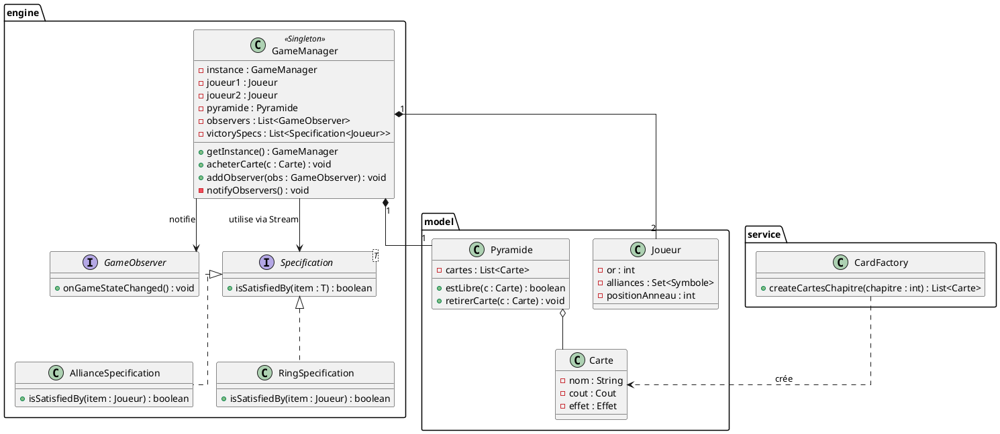
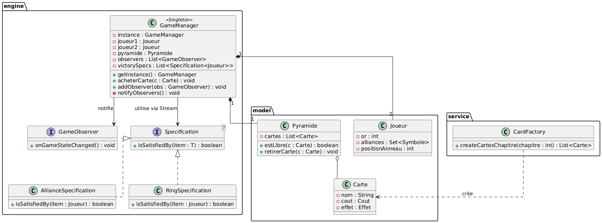
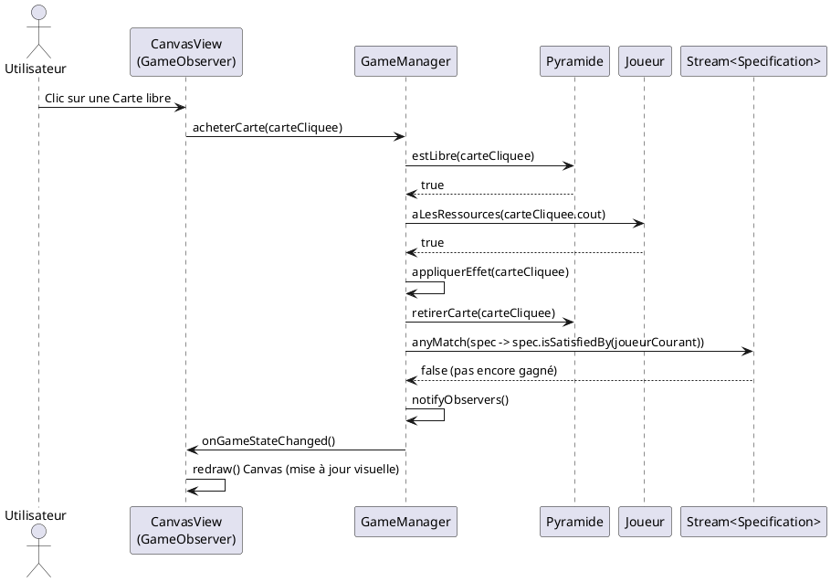
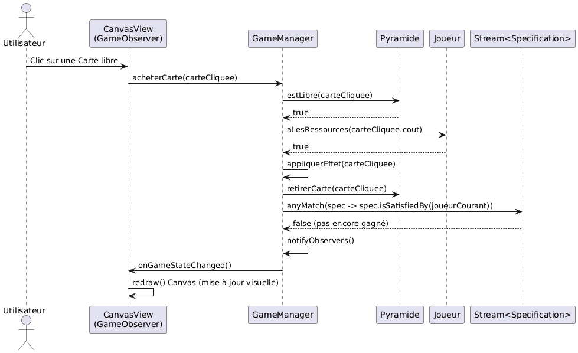

# Conception technique

> Ce document décrit l'architecture technique du projet "Duel pour la Terre du Milieu". Vous êtes dans le rôle du lead-dev / architecte. C'est un document technique destiné à des développeurs.

## Vue d'ensemble

L'application suit une architecture MVC simplifiée, adaptée au socle JavaFX/Canvas fourni :

1. **Model** — Les données pures et la logique métier isolée. `Joueur` stocke les ressources et symboles, `Carte` contient les coûts et effets, `Pyramide` gère la structure du draft.
2. **Service / Engine** — Le contrôleur central. `GameManager` orchestre les tours de jeu, valide les actions et vérifie les conditions de victoire.
3. **View** — Le rendu graphique via le `Canvas` JavaFX. Il écoute les changements d'état du modèle pour se redessiner.

## Design Patterns

### DP 1 — Singleton

**Feature associée** : Gestion centralisée de l'état de la partie (GameManager).

**Justification** : Le jeu se déroulant en Hotseat (local à deux joueurs), il est crucial qu'il n'y ait qu'une seule instance de l'arbitre du jeu pour gérer le tour du joueur actif et l'état d'avancement (chapitre actuel). Si plusieurs instances coexistaient, l'état global serait désynchronisé. Le Singleton garantit un point d'accès unique et fiable à la logique de la partie.

**Intégration** : `GameManager` possède un constructeur privé et une méthode statique `getInstance()`. Les autres services et la vue l'appellent pour soumettre les actions des joueurs.

### DP 2 — Factory

**Feature associée** : Création et instanciation des cartes du jeu.

**Justification** : Les cartes ont des configurations complexes et variées (Ressource, Alliance, Or) avec des coûts et des effets différents. Instancier ces objets directement avec des `new` un peu partout polluerait la logique métier. La Factory permet de centraliser la création des cartes, ce qui facilitera grandement leur potentielle importation depuis un fichier externe (JSON ou CSV) à l'avenir.

**Intégration** : Une classe `CardFactory` expose des méthodes comme `createCartesChapitre(int chapitre)`. Le `GameManager` appelle cette factory au début de chaque chapitre pour générer le deck.

### DP 3 — Observer

**Feature associée** : Mise à jour du Canvas JavaFX lors d'une action.

**Justification** : Le modèle métier (données) doit rester agnostique vis-à-vis de JavaFX. Lorsqu'un joueur achète une carte, le modèle doit notifier la vue de ce changement pour qu'elle se redessine, sans pour autant créer un couplage fort entre le code logique et l'interface graphique.

**Intégration** : L'interface `GameObserver` définit une méthode `onGameStateChanged()`. La classe gérant le rendu Canvas implémente cette interface et s'abonne auprès du `GameManager`.

### DP 4 — Specification

**Feature associée** : Vérification des conditions de victoire multiples via l'API Stream.

**Justification** : Le jeu possède deux conditions de victoire immédiate (Alliances et Anneau). Au lieu d'écrire des structures conditionnelles (`if/else`) imbriquées et complexes dans la boucle de jeu, le pattern Specification permet d'encapsuler chaque règle métier sous forme d'objet testable. Couplé à l'API Stream de Java, il devient très facile et élégant de filtrer et de vérifier si l'une des conditions est remplie à la fin d'un tour.

**Intégration** : Une interface fonctionnelle `Specification<T>` définit la méthode `isSatisfiedBy(T item)`. Des classes concrètes comme `AllianceSpecification` et `RingSpecification` l'implémentent. Le `GameManager` stocke une liste de ces spécifications et utilise un Stream (`specifications.stream().anyMatch(spec -> spec.isSatisfiedBy(joueurCourant))`) pour valider la victoire.

## Diagrammes UML

### Diagramme 1 — Diagramme de classes (Architecture globale)

### Diagramme 2 — Diagramme de séquence (Achat d'une carte et vérification)

