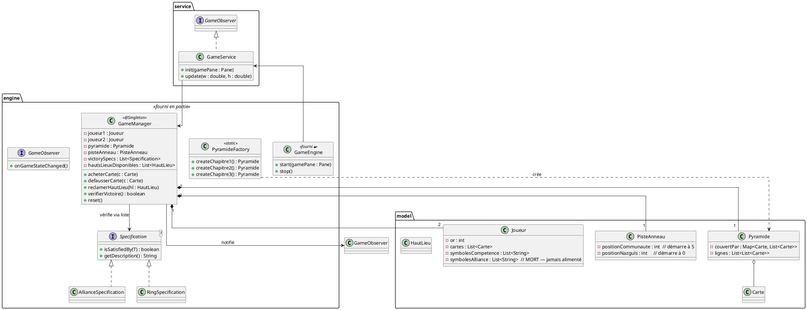

# Document de réversibilité technique

> Ce document est destiné à l'équipe qui reprendra la maintenance du projet. Soyez honnêtes et exhaustifs. Pas d'enjolivement.

## Architecture actuelle

L'application suit une architecture en 3 couches : **engine** (socle + logique métier) → **service** (rendu JavaFX) → **model** (données pures). L'injection de dépendances est gérée par **Google Guice** (annotations `jakarta.inject`).

**Flux d'exécution :**
1. `App.java` crée l'injecteur Guice et lance la fenêtre JavaFX.
2. `GameEngine.start()` appelle `GameService.init()` une fois (construction de l'UI), puis `GameService.update()` à chaque frame via `AnimationTimer` (~60 fps). `update()` est vide : toute la mise à jour se fait via l'Observer.
3. Un clic sur la pyramide → `GameManager.acheterCarte()` ou `defausserCarte()` → vérifie victoire → `notifierObservers()` → `GameService.onGameStateChanged()` reconstruit toutes les zones UI.
4. `PyramideFactory` lit `cartes.csv` **une seule fois** au chargement de la classe (bloc `static`). Les objets `Carte` sont mis en cache et réutilisés entre les parties.

## Bugs connus

| Bug | Sévérité | Conditions de reproduction |
|-----|----------|---------------------------|
| Les Hauts-Lieux ne peuvent jamais être réclamés | Bloquant (feature morte) | Cliquer sur n'importe quel Haut-Lieu : `nbForteresses` est hardcodé à 0 dans `GameManager.reclamerHautLieu()` — la condition est toujours fausse |
| Vainqueur AllianceSpec potentiellement erroné | Mineure | Si un joueur accumule 6 symboles verts sans que ce soit son tour (l'autre joueur achète la carte qui complète), `vainqueurFinal` est attribué à `joueurCourant` (le joueur qui vient d'acheter), pas à celui qui a réellement 6 symboles |
| `symbolesAlliance` dans `Joueur` jamais alimenté | Mineure (code mort) | `ajouterSymboleAlliance()` n'est appelé nulle part dans `GameManager`. Le champ existe mais est toujours vide |
| Positions de piste non bornées | Mineure | Des cartes avec `avanceAnneau` élevé peuvent pousser `positionCommunaute` ou `positionNazguls` au-delà de 15. La victoire est bien détectée au tour suivant mais l'affichage montre un index hors des 16 cases |

## Limitations techniques

- **Hauts-Lieux non fonctionnels** : l'affichage est en place (colonne droite avec les 4 cartes), mais la mécanique Forteresse (symbole d'alliance des cartes bleues militaires) a été retirée en cours de développement. Les hauts-lieux actuels sont des placeholders ("Haut-Lieu 1", "Effet 1", etc.) sans vrais effets de jeu.
- **`GameService` monolithique** : la classe fait ~870 lignes et gère à la fois le rendu de la pyramide, de la piste, des inventaires, des hauts-lieux, la musique et les overlays. Tout ajout UI passe par cette classe.
- **Cartes partagées entre parties** : `PyramideFactory.CARTES_CACHE` est statique. Les mêmes instances `Carte` sont réutilisées à chaque `reset()`. Aucun problème tant que `Carte` reste immuable — ne pas y ajouter d'état mutable.
- **Revenus initiaux absents** : les deux joueurs démarrent avec 0 or. Si toutes les cartes accessibles en base de pyramide ont un coût > 0, le premier tour est bloqué (achat impossible). Actuellement sauvé par les cartes gratuites ou les défausses (+2 or).

## Points de vigilance pour la reprise

- **`GameEngine` est 🔒** : ne pas modifier `GameEngine.java`. Toute la logique va dans `GameService` et `GameManager`.
- **Guice via `jakarta.inject`** : le projet utilise `jakarta.inject.Inject` et `jakarta.inject.Singleton` (pas `com.google.inject`). Tout nouveau service injecté doit annoter son constructeur `@Inject`. Les interfaces nécessitent un binding dans `AppModule.configure()`.
- **`GameManager` est `@Singleton` via Guice** — ne pas l'instancier avec `new`. Il n'y a pas de `getInstance()` statique : c'est Guice qui garantit l'unicité.
- **Pyramide inversée à l'affichage** : les lignes sont stockées dans l'ordre `[base (large), ..., sommet (étroit)]` dans `PyramideFactory`, mais `mettreAJourPyramide()` dans `GameService` les parcourt en sens inverse (`for r = lignes.size()-1 downto 0`) pour afficher le sommet en haut. Ne pas confondre les deux ordres.
- **Cache d'images** : `GameService.cacheImages` évite de relire les PNG à chaque rafraîchissement. Si une image est absente ou corrompue, `chargerImageCarte()` retourne `null` et met `null` en cache — le fallback rectangle coloré s'active. Un fichier ajouté après le premier accès manqué ne sera pas rechargé tant que l'application tourne.
- **`verifierVictoire()` est idempotent** : une fois `partieTerminee = true`, elle retourne `true` immédiatement sans re-vérifier. `reset()` remet `partieTerminee` à `false`.

## Améliorations recommandées

| Amélioration | Difficulté | Justification |
|--------------|------------|---------------|
| Implémenter le mécanisme Forteresse (cartes bleues) | Facile | Débloque les Hauts-Lieux ; `ajouterSymboleAlliance()` et `compterSymboleAlliance()` existent déjà dans `Joueur` |
| Remplacer les placeholders Hauts-Lieux par les vrais effets du jeu | Facile | Nécessite de définir les 4 hauts-lieux réels (Fondcombe, etc.) et d'appliquer leurs effets dans `reclamerHautLieu()` |
| Supprimer `symbolesAlliance` de `Joueur` si la Forteresse reste non implémentée | Facile | Code mort — source de confusion |
| Corriger l'attribution du vainqueur AllianceSpec | Facile | Chercher quel joueur a 6 symboles dans `verifierVictoire()` plutôt que d'utiliser `joueurCourant` |
| Borner les positions de piste à [0, 15] | Facile | Évite l'affichage incohérent et préserve la logique de victoire |
| Donner 7 or de revenu au début de chaque tour (règle officielle 7WD) | Moyen | Actuellement absente — les joueurs ne gagnent de l'or que via les cartes jaunes ou les défausses |
| Découper `GameService` en sous-composants (PyramideView, PisteView, InventaireView…) | Moyen | La classe fait ~870 lignes ; toute extension UI aggrave le problème |

